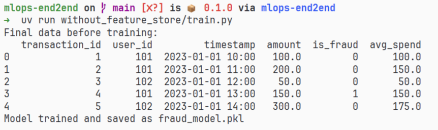

# The Manual ML Workflow: A Step-by-Step Guide

In this scenario, we are building a **Fraud Detection System**. We want to predict if a transaction is fraud based on the transaction amount and the user's average spending behavior.

### 1. The Raw Data (`data.csv`)
Imagine you have this small dataset from Kaggle. It represents historical transactions.

| transaction_id | user_id | amount | is_fraud |
| :--- | :--- | :--- | :--- |
| 1 | 101 | 100.0 | 0 |
| 2 | 101 | 200.0 | 0 |
| 3 | 102 | 50.0 | 0 |
| 4 | 101 | 150.0 | 1 |
| 5 | 102 | 300.0 | 0 |

---

### 2. Phase 1: Training the Model (`train.py`)
In your notebook or script, you perform **Manual Feature Engineering**. You decide that `avg_spend` (average of all previous transactions for that user) is a key feature.

```python
# train.py
import joblib
import pandas as pd
from sklearn.ensemble import RandomForestClassifier

df = pd.read_csv("data/data.csv")

# MANUAL FEATURE ENGINEERING:
# Calculate average spend per user up to that row
df["avg_spend"] = df.groupby("user_id")["amount"].transform(
    lambda x: x.expanding().mean()
)

print("Final data before training:")
print(df)

# Train model
X = df[["amount", "avg_spend"]]
y = df["is_fraud"]
model = RandomForestClassifier().fit(X, y)

# Save model
joblib.dump(model, "fraud_model.pkl")
print("Model trained and saved as fraud_model.pkl")
```

**Output of `train.py`:**

```

---

### 3. Phase 2: Simulating Production (`setup_db.py`)
In a real app, your API doesn't read a CSV. It reads from a database. We need to move our Kaggle data into a SQL database so the API can "look up" a user's history.

```python
import pandas as pd
import sqlite3

# Load CSV and save to a local SQLite database
df = pd.read_csv("data.csv")
conn = sqlite3.connect("production.db")
df.to_sql("transactions", conn, if_exists="replace", index=False)
conn.close()

print("Production database 'production.db' created with table 'transactions'.")
```

---

### 4. Phase 3: Serving the Model (`app.py`)
Now we build the API. When a user swipes their card, the API receives a `user_id` and an `amount`. It must **manually recreate** the `avg_spend` feature before it can ask the model for a prediction.

```python
from fastapi import FastAPI
import joblib
import pandas as pd
import sqlite3

app = FastAPI()
model = joblib.load("fraud_model.pkl")

@app.get("/predict")
def predict(user_id: int, amount: float):
    # 1. Connect to the production database
    conn = sqlite3.connect("production.db")
    
    # 2. Fetch historical data for this user
    query = f"SELECT amount FROM transactions WHERE user_id = {user_id}"
    history = pd.read_sql(query, conn)
    conn.close()
    
    # 3. DUPLICATE THE LOGIC (The Manual Way)
    # We have to re-calculate the average here in the API
    if not history.empty:
        avg_spend = history['amount'].mean()
    else:
        avg_spend = amount # Default for new users
        
    # 4. Make prediction
    features = [[amount, avg_spend]]
    prediction = model.predict(features)
    
    return {
        "user_id": user_id,
        "prediction": "Fraud" if prediction[0] == 1 else "Legit",
        "calculated_feature_avg_spend": avg_spend
    }
```

**Example API Output (Request: User 101, Amount 500):**
```json
{
  "user_id": 101,
  "prediction": "Fraud",
  "calculated_feature_avg_spend": 150.0
}
```

---

### 5. Why is this "Manual Way" dangerous?

1.  **Logic Duplication (The "Double Work" Problem):**
    Notice that we wrote the "Average" logic in `train.py` (using `.expanding().mean()`) and again in `app.py` (using `.mean()`). If you change the logic in one place but forget the other, your model will fail.
2.  **Training-Serving Skew:**
    Look at train.py and app.py.[1] You calculated the "mean" in both. If you decide to change the feature to "Average of last 5 transactions" in your notebook, your API will still be using "Average of ALL transactions" until you manually update the API code. This is Training-Serving Skew.
3.  **High Latency:**
    Every time someone swipes a card, your API has to run a SQL query and a calculation. If a user has 10,000 past transactions, the API will be **very slow**.
4.  **Data Leakage:**
    It is very easy to accidentally include the *current* transaction in your average during training, which tells the model the answer before it even makes a guess.
